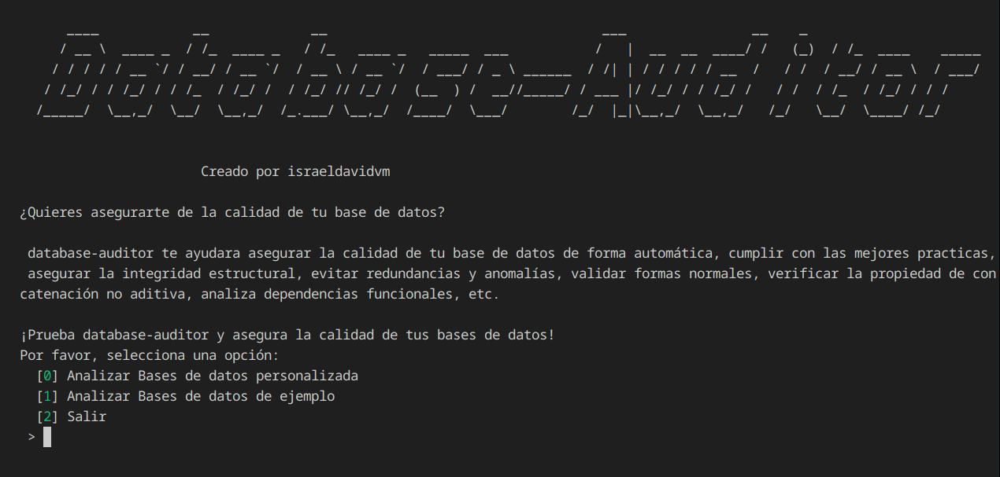

<!-- START doctoc generated TOC please keep comment here to allow auto update -->
<!-- DON'T EDIT THIS SECTION, INSTEAD RE-RUN doctoc TO UPDATE -->
**Table of Contents**  *generated with [DocToc](https://github.com/thlorenz/doctoc)*

- [data-auditor](#data-auditor)
  - [Ensure the Quality of Your Databases with data-auditor!](#ensure-the-quality-of-your-databases-with-data-auditor)
  - [License](#license)
  - [Features - What does data-auditor offer?](#features---what-does-data-auditor-offer)
    - [Threat Detection: Validate normal forms, identify non-additive join problems, etc.](#threat-detection-validate-normal-forms-identify-non-additive-join-problems-etc)
    - [Command-Line Interface](#command-line-interface)
  - [Justification](#justification)
  - [Challenges Conquered](#challenges-conquered)
  - [Features to Implement](#features-to-implement)
  - [Usage](#usage)
    - [Requirements](#requirements)
      - [Installation](#installation)
        - [As a user](#as-a-user)
        - [As a library (Only if you want to create a program that uses the library)](#as-a-library-only-if-you-want-to-create-a-program-that-uses-the-library)
      - [.env file (this is required when you want to generate a schema from the database; this is the default behavior)](#env-file-this-is-required-when-you-want-to-generate-a-schema-from-the-database-this-is-the-default-behavior)
      - [functionalDependencies.json file](#functionaldependenciesjson-file)
    - [Using from the command line interface](#using-from-the-command-line-interface)
      - [Interactive CLI database-auditor menu](#interactive-cli-database-auditor-menu)
        - [Capture main menu](#capture-main-menu)
        - [Capture menu test example databases](#capture-menu-test-example-databases)
        - [Capture menu test custom databases](#capture-menu-test-custom-databases)
        - [Analysis Results Example](#analysis-results-example)
      - [Non-interactive CLI database-auditor audit-database [<validationAlgorithms> [<databaseSchemaGeneratorConfig>]]](#non-interactive-cli-database-auditor-audit-database-validationalgorithms-databaseschemageneratorconfig)
  - [Make a donation. Your contribution will make a difference.](#make-a-donation-your-contribution-will-make-a-difference)
  - [Find me on:](#find-me-on)
  - [Planning, Requirements Engineering, Risk Management, and Evolution](#planning-requirements-engineering-risk-management-and-evolution)
  - [Software Design](#software-design)
    - [How does it work?](#how-does-it-work)
    - [Structural Perspective](#structural-perspective)
      - [Logical View of Software Architecture](#logical-view-of-software-architecture)
    - [Perspectiva de comportamiento](#perspectiva-de-comportamiento)
      - [SchemaFromDatabaseUsingName.generateJoinsClusters process / Proceso de SchemaFromDatabaseUsingName.generateJoinsClusters](#schemafromdatabaseusingnamegeneratejoinsclusters-process--proceso-de-schemafromdatabaseusingnamegeneratejoinsclusters)
      - [SchemaFromDatabaseUsingName.generate() process / Proceso de SchemaFromDatabaseUsingName.generate()](#schemafromdatabaseusingnamegenerate-process--proceso-de-schemafromdatabaseusingnamegenerate)
  - [Validation and Verification](#validation-and-verification)
    - [Formal Validation](#formal-validation)
  - [MultipleReferencedEntitiesCollision](#multiplereferencedentitiescollision)
      - [getFunctionalDependenciesForBCNFInTable](#getfunctionaldependenciesforbcnfintable)
        - [BCNF Definition](#bcnf-definition)
        - [Closing a set of Functional Dependencies](#closing-a-set-of-functional-dependencies)
        - [Inference Rules for Functional Dependencies](#inference-rules-for-functional-dependencies)
          - [Reflective Rule](#reflective-rule)
          - [Transitive, Decomposition, and Union Rules](#transitive-decomposition-and-union-rules)
          - [Augmentation and Pseudo-Transitivity Rules](#augmentation-and-pseudo-transitivity-rules)
  - [Documentation](#documentation)
    - [Conventions used during documentation](#conventions-used-during-documentation)
    - [Generation of structures required for algorithms.](#generation-of-structures-required-for-algorithms)
      - [DatabaseAuditor](#databaseauditor)
      - [DatabaseSchemaGenerator](#databaseschemagenerator)
      - [SchemaFromDBUsingName](#schemafromdbusingname)
        - [Naming conventions used for element identification](#naming-conventions-used-for-element-identification)
          - [Primary Keys](#primary-keys)
          - [Examples](#examples)
          - [Foreign Keys](#foreign-keys)
          - [Examples](#examples-1)
    - [Database Schema Validation](#database-schema-validation)
      - [ValidationAlgorithm](#validationalgorithm)
        - [VerificationNonAdditiveConcatenation](#verificationnonadditiveconcatenation)
        - [VerificationBCNF](#verificationbcnf)
  - [Technologies used / Used technologies](#technologies-used--used-technologies)

<!-- END doctoc generated TOC please keep comment here to allow auto update -->


# data-auditor

[Readme version in English](./README-EN.md)
## Ensure the Quality of Your Databases with data-auditor!



Do you want to ensure the quality of your database?

With data-auditor, get the tools that will help you comply with best practices in database design, ensure structural integrity, avoid redundancies and anomalies, validate normal forms, verify the non-additive join property, analyze functional dependencies, etc.

Try our command-line interface and ensure the quality of your databases!

## License

This code is licensed under the GNU Lesser General Public License version 3.0 or later (LGPLv3+). You can find a complete copy of the license at https://www.gnu.org/licenses/lgpl-3.0-standalone.html

## Features - What does data-auditor offer?

data-auditor is a comprehensive tool designed to guarantee the quality of your databases. It offers a set of advanced functionalities that allow you to:

### Threat Detection: Validate normal forms, identify non-additive join problems, etc.

- Normal form validation: Ensures that your design complies with normal forms, minimizing redundancy and preventing anomalies in updates.

- Non-additive join property checking: Detects potential design problems that could affect query results.

### Command-Line Interface

- Command-line interface that provides a simple and direct way to use the library, ideal for integration into automated workflows.

With data-auditor, you can guarantee a solid, efficient, and error-free database design.

## Justification

Having a poorly designed database can be one of the worst things we can face as developers. A bad design can generate the worst headaches, delays in system development, or, even worse, it can destroy one of the most valuable assets a company can have: information.

Therefore, it is necessary to have methods to guarantee the best possible design. Given the laborious nature of the methods and the need to support the quality of the design, it was decided to start this program to automate this process.

## Challenges Conquered

- Formal demonstration of algorithms

## Features to Implement

- Detection of errors in the database design that affect the functioning of the algorithms
- Validates that the table and attribute names entered as input are valid
- Support for non-conventional attribute, table, FK, and PK names
- Improve plural to singular conversion functions in SchemaFromDatabaseUsingName

## Usage

### Requirements

#### Installation

##### As a user

composer install israeldavidvm/database-auditor

composer global require israeldavidvm/database-auditor

composer require israeldavidvm/database-auditor

##### As a library (Only if you want to create a program that uses the library)
composer require israeldavidvm/database-auditor

#### .env file (this is required when you want to generate a schema from the database; this is the default behavior)

Set a configuration in the .env file. like the following

```

DB_CONNECTION=pgsql
DB_HOST=<DatabaseHostIP>
DB_PORT=5432
DB_DATABASE=<DatabaseName>
DB_USERNAME=<UserName>
DB_PASSWORD=<password>

DATA_AUDITOR_FILTER=exclude
DATA_AUDITOR_ELEMENTS=ice cream
DATA_AUDITOR_PATH_FUNCTIONAL_DEPENDENCIES_JSON_FILE=./functionDepedencies.json

```

#### functionalDependencies.json file

A file where you will configure the functional dependencies of your database. Note that the name comes from the DATA_AUDITOR_PATH_FUNCTIONAL_DEPENDENCIES_JSON_FILE environment variable written in your .env file.

```
{
"functionalDependencies": [
{
"x": [
"id"
],
"y": [
"eName"
]
},
{
"x": [
"projectName"
],
"y": [
"projectLocation"
]
},
{
"x": [
"projectNumber"
],
"y": [
"projectName",
"projectLocation"
]
},
{
"x": [
"id",
"projectNumber"
],
"y": [
"hours"
]
}
]
}
```

### Using from the command line interface

To use the program, you will only need an .env file with your database configuration and a .json file where the functional dependencies are stored.

There are two methods to use the program through a Interactive CLI or by passing programs directly to the CLI

#### Interactive CLI database-auditor menu

**If included in a project via require with the global (composer global require israeldavidvm/database-auditor)**

```~/.config/composer/vendor/bin/database-auditor menu```

**If included in a project via require without the global (composer require israeldavidvm/database-auditor)**

```./vendor/bin/database-auditor menu```

**If installed via install or starting from the project root (composer install israeldavidvm/database-auditor)**

```composer menu```

```
Description:
Displays an interactive options menu.

Usage:
menu

Options:
-h, --help Display help for the given command. When no command is given display help for the list command 
--silent Do not output any message 
-q, --quiet Only errors are displayed. All other output is suppressed 
-V, --version Display this application version 
--ansi|--no-ansi Force (or disable --no-ansi) ANSI output 
-n, --no-interaction Do not ask any interactive question 
-v|vv|vvv, --verbose Increase the verbosity of messages: 1 for normal output, 2 for more verbose output and 3 for debug

Help: 
This command displays an interactive menu and executes actions based on the user's selection.
```

##### Capture main menu


##### Capture menu test example databases


##### Capture menu test custom databases


##### Analysis Results Example

```
Reviewed Element: Applied Algorithm Result
------------------------------------------------
persons: BCNF
person_person: BCNF
scores: BCNF
person_person,person_supervisaddos,person_supervisors,scores: NAC

Meaning of the results:

BCNF: Since for every non-trivial functional dependency in the set of functional dependencies F the antecedent is a superkey, the table satisfies the definition of BCNF.

NotBCNF: Since it is false that for every non-trivial functional dependency in the set of functional dependencies F the antecedent is a superkey, the table does NOT satisfy the definition of BCNF.

NAC: The decomposition D={R1, R2, . . . , Rm} of R if it has the lossless (non-additive) concatenation property with respect to the set of dependencies F in R given that a row consists entirely of symbols a

NotNAC: The decomposition D={R1, R2, . . . , Rm} of R does not have the property of lossless (non-additive) concatenation with respect to the set of dependencies F in R since there is no row composed entirely of symbols a

VerificationBCNF: For the BCNF verification algorithm, the definition of BCNF proposed by RAMEZ ELMASRI and SHAMKANT B. NAVATHE will be used.

Furthermore, the set of non-trivial functional dependencies in which both the antecedent and the consequent are subsets of the set of attributes of the decomposition will be used, instead of using the set of non-trivial dependencies in the projection of the set of functional dependencies for that decomposition. This is because for the purposes of the BCNF verification algorithm, the sets function equivalently.

The formal proof of this statement can be found in the README.md of the database-auditor package.

VerificationNonAdditiveConcatenation: The algorithm used for verifying the non-additive concatenation property will be the one proposed by RAMEZ ELMASRI and SHAMKANT B. NAVATHE.

For the relational schema
persons(person_id, person_name)
The following functional dependencies exist:
F={

{person_id}=>{person_name}

}
Since for every non-trivial functional dependency in the set of functional dependencies F, the antecedent is a superkey, the table satisfies the BCNF definition.

For the relational schema
person_person(person_person_id, person_supervisor_id, person_supervised_id, score_id)
The following functional dependencies exist:
F={

{person_person_id}=>{person_supervisor_id, person_supervised_id, score_id}

}
Since for every non-trivial functional dependency in the set of functional dependencies F is the antecedent of a super key, and the table satisfies the definition of BCNF.

For the relational schema
scores(score_id, score_name)
The following functional dependencies exist:
F={

{score_id}=>{score_name}

}
Since for every non-trivial functional dependency in the set of functional dependencies F, the antecedent is a super key, the table satisfies the definition of BCNF


R={person_person_id,person_supervisor_id,person_supervisaddo_id,score_id,person_supervisor_name,person_supervisaddo_name,score_name}
D={

person_person={person_person_id,person_supervisor_id,person_supervisaddo_id,score_id}

person_supervisors={person_supervisor_id,person_supervisor_name}

person_supervisaddos={person_supervisaddo_id,person_supervisaddo_name}

scores={score_id,score_name}

}
There are the following dependencies Functionals
F={

{score_id}=>{score_name}

{person_id}=>{person_name}

{person_person_id}=>{person_supervisor_id,person_supervised_id,score_id}

{person_supervised_id}=>{person_supervised_name}

{person_supervisor_id}=>{person_supervisor_name}

}

Create an initial matrix S with row i for each relation Ri in D, and column j for each attribute Aj in R.

Assign S(i, j):= bij to all entries in the matrix. (* each bij is a distinct symbol associated with indices (i, j) ∗)

|b_0_0|b_0_1|b_0_2|b_0_3|b_0_4|b_0_5|b_0_6|
|b_1_0|b_1_1|b_1_2|b_1_3|b_1_4|b_1_5|b_1_6|
|b_2_0|b_2_1|b_2_2|b_2_3|b_2_4|b_2_5|b_2_6|
|b_3_0|b_3_1|b_3_2|b_3_3|b_3_4|b_3_5|b_3_6|

For each row i representing a relation schema Ri
{for each column j representing an attribute Aj
{if the (relation Ri includes an attribute Aj) then assign S(i, j):⫽ aj;};};
(* each aj is a distinct symbol associated with an index (j) ∗)

| a_0 | a_1 | a_2 | a_3 |b_0_4|b_0_5|b_0_6|
|b_1_0| a_1 |b_1_2|b_1_3| a_4 |b_1_5|b_1_6|
|b_2_0|b_2_1| a_2 |b_2_3|b_2_4| a_5 |b_2_6|
|b_3_0|b_3_1|b_3_2| a_3 |b_3_4|b_3_5| a_6 |

Repeat the following loop until a full execution of the loop produces no changes in S{for each functional dependency X → Y in F{for all rows of S that have the same symbols in the columns corresponding to the attributes of X{make the symbols in each column that correspond to an attribute of Y the same in all those rows following this pattern: if any
```

#### Non-interactive CLI database-auditor audit-database [<validationAlgorithms> [<databaseSchemaGeneratorConfig>]]

**If included in a project via require with the global (composer global require israeldavidvm/database-auditor)**

```~/.config/composer/vendor/bin/database-auditor audit-database [<validationAlgorithms> [<databaseSchemaGeneratorConfig>]]```

**If included in a project via require without the global (composer require israeldavidvm/database-auditor)**

```./vendor/bin/database-auditor audit-database [<validationAlgorithms> [<databaseSchemaGeneratorConfig>]]```

**If installed via install or starting from the project root (composer install israeldavidvm/database-auditor)**

```composer audit-database [<validationAlgorithms> [<databaseSchemaGeneratorConfig>]]```

```
Description:
This command allows you to perform a series of validations on your database. It redirects the output to pass the information to a file.

Usage:
audit-database [<validationAlgorithms> [<databaseSchemaGeneratorConfig>]]

Arguments:
validationAlgorithms: Value of the validation algorithm types to apply, separated by a comma (,). Example: VerificationBCNF,VerificationNonAdditiveConcatenation [default: "VerificationBCNF,VerificationNonAdditiveConcatenation"]
databaseSchemaGeneratorConfig: String specifying the databaseSchemaGenerator and its configuration. Where the string has a format like next<databaseSchemaGenerator>|<path>Where <databaseSchemaGenerator>::=SchemaFromDatabaseUsingName|SchemaFromJSON Is the value of the database schema generator type. <path>Is the path to the .json file in the case of SchemeFromJson or the path to the .env file in the case of SchemaFromDatabaseUsingName [default: "SchemaFromDatabaseUsingName|./.env"]

Options:
-h, --help Display help for the given command. When no command is given, display help for the list command.
--silent Do not output any messages.
-q, --quiet Only errors are displayed. All other output is suppressed 
-V, --version Display this application version 
--ansi|--no-ansi Force (or disable --no-ansi) ANSI output 
-n, --no-interaction Do not ask any interactive question 
-v|vv|vvv, --verbose Increase the verbosity of messages: 1 for normal output, 2 for more verbose output and 3 for debug
```

## Make a donation. Your contribution will make a difference.
[](https://ko-fi.com/israeldavidvm)
[](https://paypal.me/israeldavidvm)
[](https://www.binance.com/activity/referral-entry/CPA?ref=CPA_004ZGH9EIS)

## Find me on:
[](https://github.com/israeldavidvm)
[](https://www.linkedin.com/in/israeldavidvm/)
[](https://twitter.com/israeldavidvm)
[](https://www.facebook.com/israeldavidvm)
[](https://www.instagram.com/israeldavidvm/)
[](https://www.tiktok.com/@israeldavidvm)
[](https://www.youtube.com/channel/UCmZLFpEPNdwpJOhal0wry7A)
## Planning, Requirements Engineering, Risk Management, and Evolution

These sections of the project will be carried out through a Notion site so that they can be easily accessible by non-technical personnel.

Request the access link for authorized personnel.

## Software Design

### How does it work?

Basically, the program operates with the following steps:

1) A mechanism is chosen to generate the structures necessary for the algorithms.

2) The algorithms are applied to verify the database.

### Structural Perspective

#### Logical View of Software Architecture

The following class diagram shows the key abstractions in the system, their interactions, and responsibilities.

``` mermaid
---
title: database auditor
---
classDiagram

class DatabaseAuditor{

}

note for DatabaseAuditor "Aims to be the context for the different strategies used
and a means of encapsulating utility functions
common to all algorithms"

DatabaseAuditor ..> DatabaseSchemaGenerator
DatabaseAuditor ..> Report
DatabaseAuditor ..> Schema

class DatabaseSchemaGenerator{
<<Abstract>>
+databaseAuditor
+generate()
}

note for DatabaseSchemaGenerator "Provides the strategy interface
that is common to all concrete strategies
for generating database schemas"

DatabaseSchemaGenerator <|-- SchemaFromDBUsingName
DatabaseSchemaGenerator <|-- SchemaFromJSON

class Schema{

}

class SchemaFromJSON{
+databaseAuditor
+generate()
}

class SchemaFromDBUsingName{
+databaseAuditor
+generate()
}

SchemaFromDBUsingName ..> Schema
SchemaFromJSON ..> Schema

note for Schema "Provides a data structure that contains the information that the validation algorithms will use."

note for SchemaFromDBUsingName "It is one of the specific strategies that generates schemas using the database's naming conventions."

DatabaseAuditor ..> ValidationAlgorithm

note for ValidationAlgorithm "Provides the strategy interface that is common to all specific strategies for generating database validations."

class ValidationAlgorithm{
<<Abstract>> 
+execute() 
+explainPossibleResults()$ 
+explainResult(result)$ 
} 

ValidationAlgorithm <|-- VerificationNonAdditiveConcatenation 
ValidationAlgorithm <|-- VerificationBCNF 

Report <.. VerificationNonAdditiveConcatenation 
Report <.. VerificationBCNF 

class Report{ 
+addVerification($element,$result,$message) 
} 

class VerificationNonAdditiveConcatenation{ 
+databaseAuditor 
+execute() 
} 


note for VerificationNonAdditiveConcatenation "Encapsulates Verification Algorithm 11.1
of the non-additive concatenation property proposed by RAMEZ ELMASRI
and SHAMKANT B. NAVATHE" 

class VerificationBCNF{ 
+databaseAuditor 
+execute() 
} 

note for VerificationBCNF "Encapsulates the Algorithm that validates that each decomposition possesses the BCNF, based on the definition presented by RAMEZ ELMASRI and SHAMKANT B. NAVATHE.

DatabaseAuditor <.. Client

class Client{

}

```
### Perspectiva de comportamiento

#### SchemaFromDatabaseUsingName.generateJoinsClusters process / Proceso de SchemaFromDatabaseUsingName.generateJoinsClusters


#### SchemaFromDatabaseUsingName.generate() process / Proceso de SchemaFromDatabaseUsingName.generate()


## Validation and Verification

Formal mathematical verification techniques and unit testing will be used to validate and verify the program.

The tests are located in the tests folder

and can be inspected using the command ./vendor/bin/phpunit or ./vendor/bin/phpunit --coverage-html tests/coverage if you want the code coverage reports in HTML format.

### Formal Validation

## MultipleReferencedEntitiesCollision

1. If e belongs to Entities and there is a fk, then it belongs to foreignKeysDeEntidad(e) such that FKReferencedEntity(fk) == e

2. If n belongs to Nary Entities, then there are fk1 and fk2 that belong to foreignKeysDeEntidad(e) such that FKReferencedEntity(fk1) == FKReferencedEntity(fk2)

#### getFunctionalDependenciesForBCNFInTable

The goal of this section is to demonstrate that the algorithm can be used to generate the set of functional dependencies necessary for Validate the BCNF (Boyce-Codd Normal Form).

The new algorithm we will present below is based on the idea that, to apply BCNF verification to each decomposition, we can use the set of functional dependencies in which both the antecedent and the consequent are subsets of the decomposition's attribute set, instead of using the projection of the set of functional dependencies for that decomposition, since the latter option turns out to be a more complex set to work with.

To this end, it is important to keep in mind that

A relation schema R is in BCNF if whenever a non-trivial functional dependency X → A holds in R, then X is a superkey of R.

##### BCNF Definition

[another way of expressing BCNF](images/bcnf_definition.png)

and that the set of functional dependencies for a decomposition is the projection of the set of dependencies of the universal relation projected for a decomposition.

That is,


Where F+ is the closure of a set of functional dependencies

##### Closing a set of Functional Dependencies

Formally, the set of all dependencies that include F, along with the dependencies that can be inferred from F, are called closures of F; they are denoted by F+.

##### Inference Rules for Functional Dependencies

Recall that the well-known inference rules for functional dependencies are


That said, note that the following occurs for inference rules when applied to the BCNF algorithm:

###### Reflective Rule

For the reflexive rule, the generated functional dependencies x->y require that x be a subset of y, so it only generates trivial dependencies, which are not taken into account in BCNF.

###### Transitive, Decomposition, and Union Rules

For the transitive, decomposition, and union rules, the antecedent of the functional dependencies does not change. If the antecedent is a superkey, the decomposition will satisfy the BCNF rule. If x is a super key, the decomposition will not satisfy the BCNF rule, that is, the decompositions inferred with these rules will not affect the result.

###### Augmentation and Pseudo-Transitivity Rules

For the case of the augmentation and pseudo-transitivity rules, it happens that the antecedent X is joined with another set W or Z in either case. In either case, the following happens:
If x is a super key, only rules in which the antecedent is still a super key can be inferred.
If x is not a super key, rules that are super keys can be inferred. However, if x is not a super key, we already know that by the definition of BCNF, this form does not hold.

In conclusion:
For the case of BCNF validation, we can use the
## Documentation

The data-auditor package allows you to perform a series of validations and improvements to the quality of a database design, such as checking for normal forms, verifying the non-additive concatenation property, etc.

### Conventions used during documentation

Notation conventions for the grammar:

The <> is used to surround a non-terminal symbol.

The ::= is used for production rules.

Non-terminal symbols are expressed as a string or normal characters.

The following group of symbol pairs should be used with expressions as follows: the first in each pair is written as a suffix after the expression, and the second surrounds the expression.

The ? or [] indicate that the expression is optional.

The * or {} indicates that the expression is repeated 0 or more times.

The + indicates that the expression is repeated 1 or more times.

If you want to use one of the above characters, you must precede the \ with

### Generation of structures required for algorithms.

For the algorithms to work, certain structures must be generated to which they can be applied.

These structures are generated from the database schemas. These structures can be specified in different ways.

Unfortunately, some DBMSs support SQL standards differently, so there is no universal algorithm that works perfectly for all DBMSs.

Therefore, the software was designed taking into account the possibility of using different algorithms. More specifically, the strategy pattern will be used to allow algorithm interchange.

The structures responsible for this will be the following:

#### DatabaseAuditor
It aims to serve as the context for the different strategies used and a means of encapsulating utility functions common to all algorithms.

#### DatabaseSchemaGenerator
Provides the strategy interface, which is common to all specific strategies, for generating database schemas.

#### SchemaFromDBUsingName
This is one of the specific strategies that generates schemas using the names of the database columns.

While the information_schema view set could be used to determine some of the database structures,

It was discovered that additive joins are often generated in PostgreSQL.

For example, if one wanted to know if a column in information_schema.key_column_usage is a PRIMARY KEY, FOREIGN KEY, etc., the query should be used

```sql
SELECT kcu.column_name,kcu.table_name,tc.constraint_name,tc.constraint_type
FROM
information_schema.table_constraints tc
JOIN
information_schema.key_column_usage kcu
ON tc.constraint_name = kcu.constraint_name
```
However, if we look closely, these results are affected by an additive join.

For the particular case of having
```sql
SELECT column_name,table_name FROM information_schema.key_column_usage WHERE table_name ~ '^insight_taxonomy$'
```

which returns results of this shape


and a
```sql
SELECT tc.constraint_name 
FROM 
information_schema.table_constraints tc 
WHERE 
tc.constraint_name ~ '^taxonomy_id_fkey$'
```
which gives results like this


you have to

```sql
SELECT kcu.column_name,kcu.table_name,tc.constraint_name,tc.constraint_type 
FROM
information_schema.table_constraints tc
JOIN
information_schema.key_column_usage kcu
ON tc.constraint_name = kcu.constraint_name
WHERE
kcu.table_name ~ '^insight_taxonomy$'

```

generates the following results that reflect the additive join:


##### Naming conventions used for element identification

###### Primary Keys
Any attribute with the name id

###### Examples
id

###### Foreign Keys
Any attribute with the following form
```
<singularTableName>[_<role>]_id

Where [role] is used to identify the entity in recursive relationships

```

Matches the following regular expression
```
^[a-zA-Z0-9ñ]+(?:_[a-zA-Z0-9ñ]+)?_id$
```
###### Examples
- user_id
- taxonomy_child_id
- taxonomy_parent_id

### Database Schema Validation

The purpose of this library is to provide validations for database schemas, and the following structures will be used:

#### ValidationAlgorithm
Provides the strategy interface that is common to all specific strategies for generating database validations
##### VerificationNonAdditiveConcatenation

Encapsulates Algorithm 11.1 for verifying the non-additive concatenation property proposed by RAMEZ ELMASRI and SHAMKANT B. NAVATHE

##### VerificationBCNF

Encapsulates the algorithm that validates that each decomposition possesses BCNF based on the definition presented by RAMEZ ELMASRI and SHAMKANT B. NAVATHE

The algorithm uses the set of non-trivial functional dependencies in which both the antecedent and the consequent are subsets of the decomposition's attribute set, instead of using the set of non-trivial dependencies in the projection of the set of functional dependencies for that decomposition. This is because, for the purposes of the algorithm to verify BCNF, the sets function equivalently.

The formal proof of this assertion can be found in the README.md of the database-auditor package.

## Technologies used / Used technologies

[]()