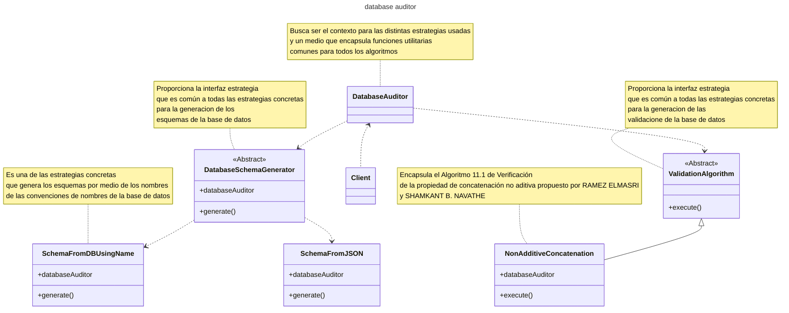
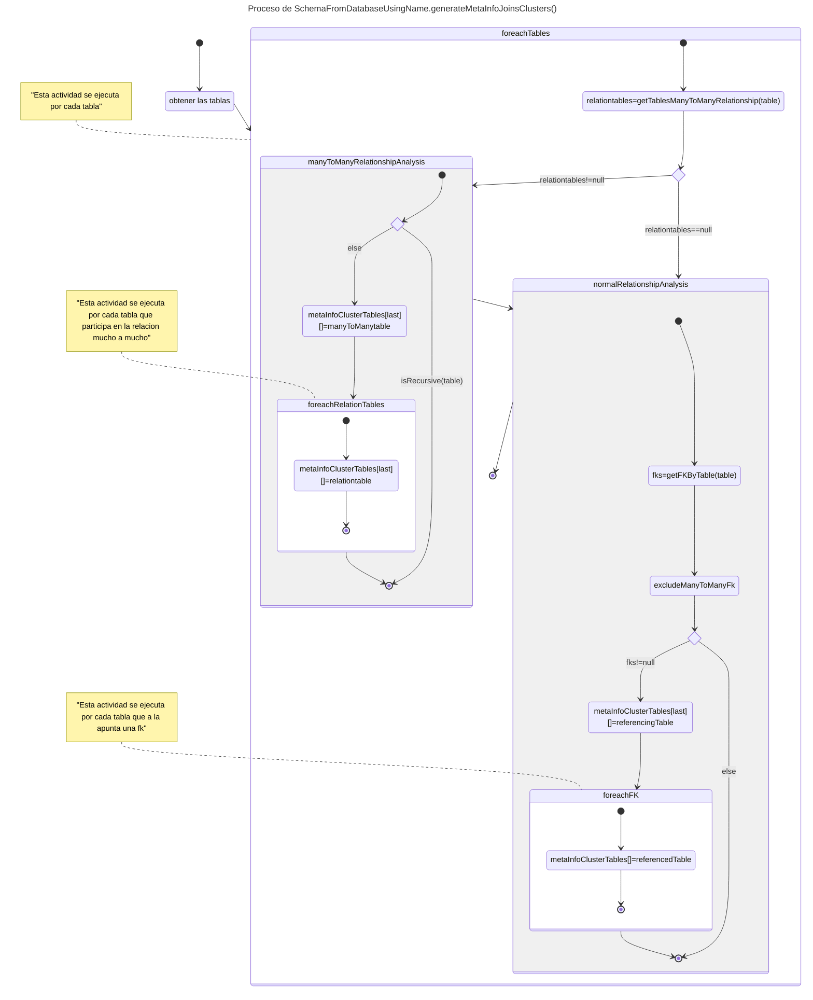
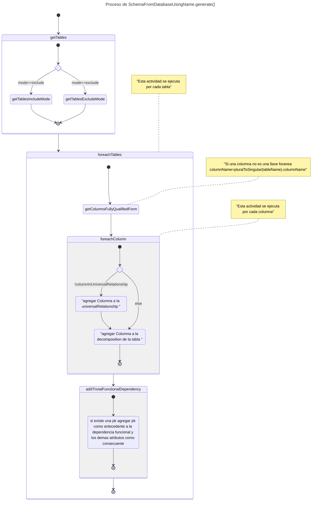

# data-auditor

[Readme version in English](./README-EN.md)

## data-auditor: Lleva tu diseño de bases de datos al siguiente nivel

Data-auditor es una herramienta de software libre diseñada para mejorar significativamente la calidad de tus diseños de bases de datos. Al realizar una serie de validaciones rigurosas, como la comprobación de las formas normales y la verificación de la propiedad de concatenación no aditiva, data-auditor te ayuda a identificar y corregir potenciales problemas en tu esquema de datos.

## Licencia

Este código tiene licencia bajo la licencia pública general de GNU versión 3.0 o posterior (LGPLV3+). Puede encontrar una copia completa de la licencia en https://www.gnu.org/licenses/lgpl-3.0-standalone.htmlalone.html0-standalone.html

## Caracteristicas ¿Qué te ofrece data-auditor?

data-auditor te ofrece un conjunto completo de herramientas para evaluar y mejorar la calidad de tu diseño de base de datos. Algunas de sus principales características incluyen:

- Validación de formas normales: Verifica si tu diseño cumple con las primeras tres formas normales, lo que es esencial para evitar la redundancia y las anomalías de actualización.

- Comprobación de la propiedad de concatenación no aditiva: Identifica posibles problemas de diseño que podrían llevar a resultados inesperados en las consultas.

- Análisis de dependencias funcionales: Te ayuda a comprender las relaciones entre los atributos de tus tablas.

## Challenges conquered / Desafíos Conquistados

## Features to implement / Caracteristicas a implementar

- Valida que los nombres de tablas y atributos ingresados como entrada sean validos
- Soporte a nombres a atributos, tablas, fk y pk no convencionales

## Requirements Engineering / Ingenieria de Requerimientos

###  High Level or user requirements / Requerimientos de Alto Nivel o de Usuario

#### Functional requirements / Requerimientos funcionales
#### Non -functional requirements / Requerimientos no funcionales

### Low Level or System Requirements / Requerimientos de Bajo Nivel o de Sistema

#### Functional requirements / Requerimientos funcionales
#### Non -functional requirements / Requerimientos no funcionales


## Software Design / Diseño de Software

### Perspectiva Estructural

#### Vista Logica de la Arquitectura del software 

En el siguiente diagrama de clases se veran las abstracciones clave en el sistema, sus interaciones  responsabilidades.




### Perspectiva de comportamiento

#### DatabaseAuditor.generateMetaInfoJoinsClusters() process / Proceso de DatabaseAuditor.generateMetaInfoJoinsClusters()



#### SchemaFromDatabaseUsingName.generate() process / Proceso de SchemaFromDatabaseUsingName.generate()



## Documentacion

El paquete data-auditor permite realizar una serie de validaciones y mejoras a la calidad del diseño de una base de datos como la comprobacion de formas normales, verificación 
de la propiedad de concatenación no aditiva, etc.

### Convenciones usadas durante la docuemntacion

Convenciones de notacion para la gramatica:

Los <> se utilizan para rodear un simbolo no terminal

El ::= se utiliza para reglas de produccion

Los simbolos no terminales se expresan como una cadena o caracteres normales

El siguiente grupo de pares de simbolos, se deben utilizar junto a las expresiones de la siguiente forma: el primero en cada pareja se escribe como sufijo despues de la expresion y el segundo rodea la expresion. 

El ? o [] indican que la expresion es opcional

El * o {} indica que la expresion se repite 0 o mas veces

El + indica que la expresion se repite 1 o mas veces

Si se quiere usar uno de los caracteres anteriores se debe de anteceder \ con 

### Generacion de esquemas

Para que los algoritmos funcionen se debe de generar una representacion de la base de datos 
sobre la cual aplicar dichos algoritmos

Lamentablemente algunos SGBD, dan soporte a los estadares de sql de forma diferente por lo que no existe una algoritmo universal que funcione perfectamente para todos los SGBD.

De manera que el software se diseño tomando en cuenta la posibilidad de utilizar diferentes algoritmos. Mas concretamente se utilizara el patron strategy para permitir el intercambio de algoritmos

Las estructuras responsables para esto seran las siguientes:

#### DatabaseAuditor 
Busca ser el contexto para las distintas estrategias usadas y un medio que encapsula funciones utilitarias comunes para todos los algoritmos

#### DatabaseSchemaGenerator 
proporciona la interfaz estrategia 
que es común a todas las estrategias concretas 
para la generacion de los 
esquemas de la base de datos

#### SchemaFromDBUsingName 
Es una de las estrategias concretas  que genera los esquemas por medio de los nombres
de las columnas de la base de datos

Si bien se pudo usar el conjunto de vistas de information_schema para determinar algunas de las estructuras de la base de datos

Se descubrio que en postgresql se suelen generar joins aditivos 

Por ejemplo si se quisiera saber si una columna en la information_schema.key_column_usage es una PRIMARY KEY, FOREIGN KEY, etc, deberia usarse la consulta

```sql
SELECT kcu.column_name,kcu.table_name,tc.constraint_name,tc.constraint_type 
            FROM 
                information_schema.table_constraints tc
            JOIN
                information_schema.key_column_usage kcu
                    ON tc.constraint_name = kcu.constraint_name
```    
Sin embargo si observamos detenidamente dichos resultados se ven afectados por un join aditivo

Para el caso particular de tener
```sql
SELECT column_name,table_name FROM information_schema.key_column_usage WHERE table_name ~ '^insight_taxonomy$'
```

que arroja resultados de esta forma


y un 
```sql
SELECT tc.constraint_name
            FROM 
                information_schema.table_constraints tc               
            WHERE 
				tc.constraint_name ~ '^taxonomy_id_fkey$'
```
que arroja resultados de esta forma


se tiene que el

```sql
SELECT kcu.column_name,kcu.table_name,tc.constraint_name,tc.constraint_type 
            FROM 
                information_schema.table_constraints tc
            JOIN
                information_schema.key_column_usage kcu
                    ON tc.constraint_name = kcu.constraint_name
            WHERE 
				kcu.table_name ~ '^insight_taxonomy$'

```

genera los siguientes resultados que reflejan el join aditivo


##### Convenciones de nombres usada para la identificacion de elementos

##### Llaves Primarias
Todo atributo de nombre id 

###### Ejemplos
id

##### Llaves Foraneas
Todo atributo que posee la siguiente forma 
```
<nombreTablaSigular>_[rol]_id 

Donde [rol] sirve para identificar a la entidad en las relaciones recursivas

```

Coincide con la siguiente expresion regular
```
^[a-zA-Z0-9ñ]+_?[a-zA-Z0-9ñ]*_id$
```
###### Ejemplos
user_id
taxonomy_child_id
taxonomy_parent_id

### Ejemplos de uso

#### Almacenar la url de las imagenes en la bd:

Para almacenar una imagen responsive en la base de datos de una aplicacion laravel  se recomienda usar 

```
NameHelper::generateLaravelConvetionalResponsiveImageDirUrl($imageName)
```

Lo que generara una url de imagen como 
```/storage/images/imagen/```

Para el caso de imagenes no responsivas

```
NameHelper::generateLaravelConvetionalImageUrl($imageName)
```

Lo que generara una url de imagen como 
```/storage/images/imagen/imagen.jpg```

#### Recuperar imagenes en la bd:

Notese que las imagenes responsives estan almacenadas en un directorio

De manera que los nombres para cada una de las imagenes responsive deben obtenerse por medio de

```
NameHelper::generateResponsiveImageUrls($imageName, $baseUrl);
```

o 

```
NameHelper::generateConvetionalResponsiveImageUrls($imageName,$baseUrl)
```

O 
```
NameHelper::generateLaravelConvetionalResponsiveImageUrls($imageName)
```
#### Mas ejemplos de uso
```
Probando la salida de los metodos con

$fileLocator='/imagen.png'
$baseUrl='/cachapa/'

NameHelper::generateLaravelConvetionalResponsiveImageUrls('/imagen.png')=[
/storage/images/imagen/imagen.png
/storage/images/imagen/360-imagen.png
/storage/images/imagen/720-imagen.png
/storage/images/imagen/1080-imagen.png
/storage/images/imagen/1440-imagen.png
/storage/images/imagen/1800-imagen.png
/storage/images/imagen/2160-imagen.png
/storage/images/imagen/2880-imagen.png
/storage/images/imagen/3600-imagen.png
/storage/images/imagen/4320-imagen.png
]
NameHelper::generateLaravelConvetionalResponsiveImageDirUrl('/imagen.png')=/storage/images/imagen
NameHelper::generateLaravelConvetionalImageUrl('/imagen.png')=/storage/images/imagen/imagen.png
NameHelper::generateLaravelConvetionalImagePath('/imagen.png')=/images/imagen/imagen.png
NameHelper::generateConvetionalResponsiveImageUrls('/imagen.png','/cachapa/')=[
/cachapa/imagen/imagen.png
/cachapa/imagen/360-imagen.png
/cachapa/imagen/720-imagen.png
/cachapa/imagen/1080-imagen.png
/cachapa/imagen/1440-imagen.png
/cachapa/imagen/1800-imagen.png
/cachapa/imagen/2160-imagen.png
/cachapa/imagen/2880-imagen.png
/cachapa/imagen/3600-imagen.png
/cachapa/imagen/4320-imagen.png
]
NameHelper::generateConvetionalImageUrl('/imagen.png','/cachapa/')=/cachapa/imagen/imagen.png
NameHelper::generateResponsiveImageUrls('/imagen.png','/cachapa/')=[
/cachapa/imagen.png
/cachapa/360-imagen.png
/cachapa/720-imagen.png
/cachapa/1080-imagen.png
/cachapa/1440-imagen.png
/cachapa/1800-imagen.png
/cachapa/2160-imagen.png
/cachapa/2880-imagen.png
/cachapa/3600-imagen.png
/cachapa/4320-imagen.png
]
NameHelper::generateConvetionalImageDirUrl('/imagen.png','/cachapa/')=/cachapa/imagen
NameHelper::generateImageUrl('/imagen.png','/cachapa/')=/cachapa/imagen.png
NameHelper::generateResponsiveImageNames('/imagen.png')=[
/imagen.png
360-/imagen.png
720-/imagen.png
1080-/imagen.png
1440-/imagen.png
1800-/imagen.png
2160-/imagen.png
2880-/imagen.png
3600-/imagen.png
4320-/imagen.png
]
NameHelper::transformNameToUrlName('/imagen.png')=imagen.png
NameHelper::getFileOrDirName('/imagen.png')=imagen.png
NameHelper::getFileOrDirNameWithoutExt('/imagen.png')=imagen
NameHelper::getExtOfFile('/imagen.png')=png

Probando la salida de los metodos con

$fileLocator='/imagen/'
$baseUrl='/cachapa/'

$imageName='imagen' de generateResponsiveImageNames pareciera no tener una extension
NameHelper::generateLaravelConvetionalResponsiveImageDirUrl('/imagen/')=/storage/images/imagen
NameHelper::generateLaravelConvetionalImageUrl('/imagen/')=/storage/images/imagen/imagen
NameHelper::generateLaravelConvetionalImagePath('/imagen/')=/images/imagen/imagen
$imageName='imagen' de generateResponsiveImageNames pareciera no tener una extension
NameHelper::generateConvetionalImageUrl('/imagen/','/cachapa/')=/cachapa/imagen/imagen
$imageName='imagen' de generateResponsiveImageNames pareciera no tener una extension
NameHelper::generateConvetionalImageDirUrl('/imagen/','/cachapa/')=/cachapa/imagen
NameHelper::generateImageUrl('/imagen/','/cachapa/')=/cachapa/imagen
$imageName='/imagen/' de generateResponsiveImageNames pareciera no tener una extension
NameHelper::transformNameToUrlName('/imagen/')=imagen
NameHelper::getFileOrDirName('/imagen/')=imagen
NameHelper::getFileOrDirNameWithoutExt('/imagen/')=imagen
$fileLocatorName='/imagen/' de getExtOfFile pareciera no tener una extension
```

### Make a donation. Your contribution will make a difference.
[](https://ko-fi.com/israeldavidvm)
[](https://paypal.me/israeldavidvm)
[](https://www.binance.com/activity/referral-entry/CPA?ref=CPA_004ZGH9EIS)

### Find me on:
[](https://github.com/israeldavidvm)
[](https://www.linkedin.com/in/israeldavidvm/)
[](https://twitter.com/israeldavidvm)
[](https://www.facebook.com/israeldavidvm)
[](https://www.instagram.com/israeldavidvm/)
[](https://www.tiktok.com/@israeldavidvm)
[](https://www.youtube.com/channel/UCmZLFpEPNdwpJOhal0wry7A)

## Technologies used / Tecnologias usadas

[]() 
