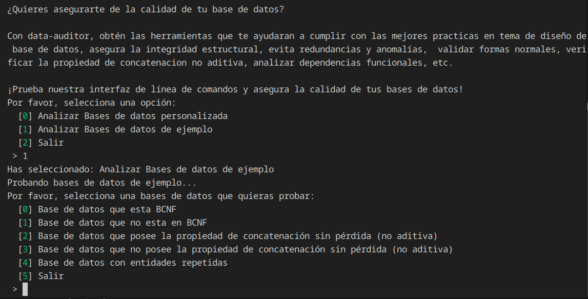
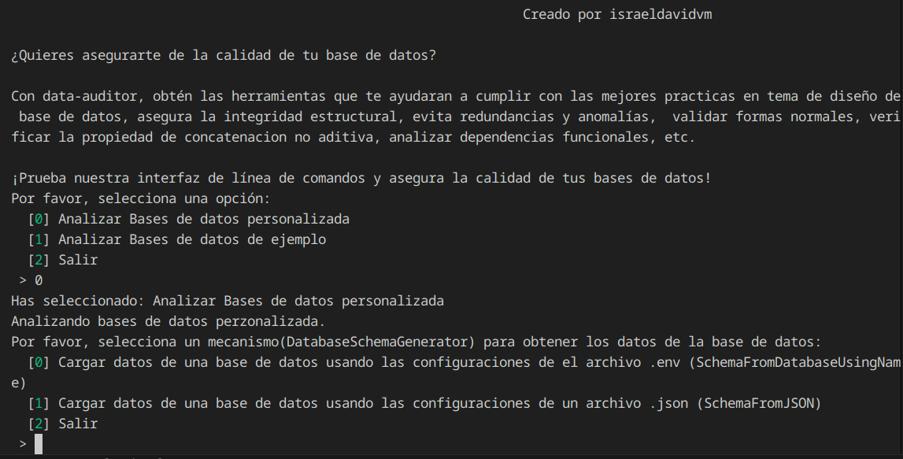
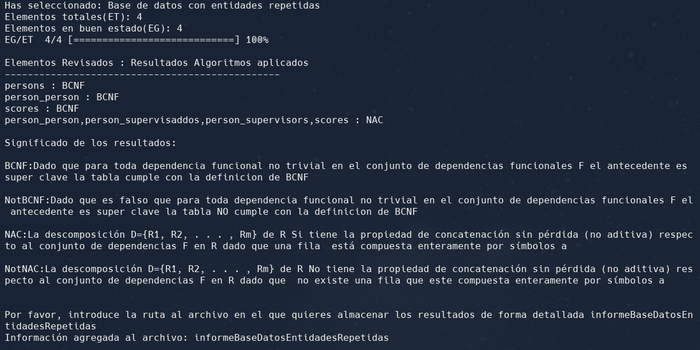
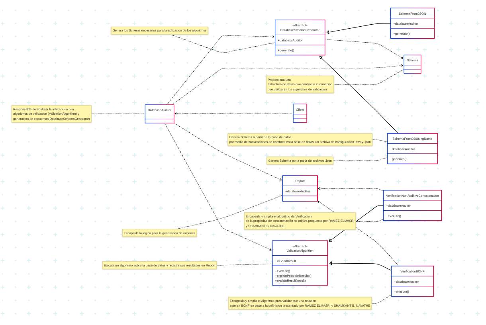
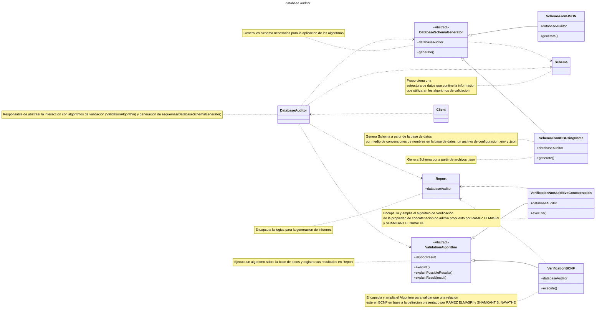
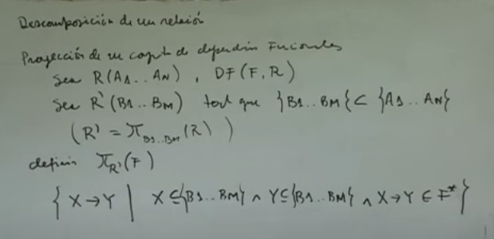
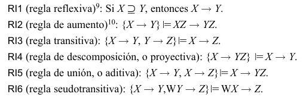

<!-- START doctoc generated TOC please keep comment here to allow auto update -->
<!-- DON'T EDIT THIS SECTION, INSTEAD RE-RUN doctoc TO UPDATE -->
**Table of Contents**  *generated with [DocToc](https://github.com/thlorenz/doctoc)*

- [database-auditor](#database-auditor)
  - [¡Asegura la calidad de tus bases de datos con database-auditor!](#%C2%A1asegura-la-calidad-de-tus-bases-de-datos-con-database-auditor)
  - [Licencia](#licencia)
  - [Caracteristicas ¿Qué ofrece?](#caracteristicas-%C2%BFqu%C3%A9-ofrece)
    - [Deteccion de Amenazas : Valida formas normales, identifica problemas de concatenación no aditiva, etc.](#deteccion-de-amenazas--valida-formas-normales-identifica-problemas-de-concatenaci%C3%B3n-no-aditiva-etc)
    - [Interfaz de línea de comandos](#interfaz-de-l%C3%ADnea-de-comandos)
  - [Justificacion](#justificacion)
  - [Challenges conquered / Desafíos Conquistados](#challenges-conquered--desaf%C3%ADos-conquistados)
  - [Features to implement / Caracteristicas a implementar](#features-to-implement--caracteristicas-a-implementar)
  - [Uso](#uso)
    - [Advertencia](#advertencia)
    - [Requisitos](#requisitos)
      - [Instalacion](#instalacion)
        - [Como usuario](#como-usuario)
        - [Como biblioteca (Solo si quieres crear un programa que use la libreria)](#como-biblioteca-solo-si-quieres-crear-un-programa-que-use-la-libreria)
      - [Archivo .env (esto es necesario cuando se quiere generar un esquema a partir de la base de datos el comportamiento por defecto)](#archivo-env-esto-es-necesario-cuando-se-quiere-generar-un-esquema-a-partir-de-la-base-de-datos-el-comportamiento-por-defecto)
      - [Archivo functionalDependencies.json](#archivo-functionaldependenciesjson)
    - [Uso desde la interfaz de linea de comandos](#uso-desde-la-interfaz-de-linea-de-comandos)
      - [CLI interactiva database-auditor  menu](#cli-interactiva-database-auditor--menu)
        - [Capture menu principal](#capture-menu-principal)
        - [Capture menu probar bases de datos de ejemplo](#capture-menu-probar-bases-de-datos-de-ejemplo)
        - [Capture menu probar bases de datos personalizada](#capture-menu-probar-bases-de-datos-personalizada)
        - [Ejemplo resultados analisis](#ejemplo-resultados-analisis)
      - [CLI no interactiva database-auditor  audit-database [<validationAlgorithms> [<databaseSchemaGeneratorConfig>]]](#cli-no-interactiva-database-auditor--audit-database-validationalgorithms-databaseschemageneratorconfig)
  - [Make a donation. Your contribution will make a difference.](#make-a-donation-your-contribution-will-make-a-difference)
  - [Find me on:](#find-me-on)
  - [Planeacion, Ingenieria de requerimientos, gestion del riesgo y evolucion](#planeacion-ingenieria-de-requerimientos-gestion-del-riesgo-y-evolucion)
  - [Diseño de Software](#dise%C3%B1o-de-software)
    - [¿Como funciona?](#%C2%BFcomo-funciona)
    - [Perspectiva Estructural](#perspectiva-estructural)
      - [Vista Logica de la Arquitectura del software](#vista-logica-de-la-arquitectura-del-software)
    - [Perspectiva de comportamiento](#perspectiva-de-comportamiento)
      - [SchemaFromDatabaseUsingName.generateJoinsClusters process / Proceso de SchemaFromDatabaseUsingName.generateJoinsClusters](#schemafromdatabaseusingnamegeneratejoinsclusters-process--proceso-de-schemafromdatabaseusingnamegeneratejoinsclusters)
      - [SchemaFromDatabaseUsingName.generate() process / Proceso de SchemaFromDatabaseUsingName.generate()](#schemafromdatabaseusingnamegenerate-process--proceso-de-schemafromdatabaseusingnamegenerate)
  - [Validacion y Verificacion](#validacion-y-verificacion)
    - [Formal validation / Validacion Formal](#formal-validation--validacion-formal)
  - [MultipleReferencedEntitiesCollision](#multiplereferencedentitiescollision)
      - [getFunctionalDependenciesForBCNFInTable](#getfunctionaldependenciesforbcnfintable)
        - [BCNF Definition / Definicion BCNF](#bcnf-definition--definicion-bcnf)
        - [Closing a set of Functional Dependencies / Clasura de un conjunto de dependencias funcionales](#closing-a-set-of-functional-dependencies--clasura-de-un-conjunto-de-dependencias-funcionales)
        - [Inference Rules for Functional Dependencies / Reglas de inferencia para las dependencias funcionales](#inference-rules-for-functional-dependencies--reglas-de-inferencia-para-las-dependencias-funcionales)
          - [Regla reflesiva](#regla-reflesiva)
          - [Reglas transitiva, de descomposicion y union](#reglas-transitiva-de-descomposicion-y-union)
          - [Reglas de de aumento y pseudo-transitividad](#reglas-de-de-aumento-y-pseudo-transitividad)
  - [Documentacion](#documentacion)
    - [Convenciones usadas durante la docuemntacion](#convenciones-usadas-durante-la-docuemntacion)
    - [Generacion de estructuras necesarias para los algoritmos](#generacion-de-estructuras-necesarias-para-los-algoritmos)
      - [DatabaseAuditor](#databaseauditor)
      - [DatabaseSchemaGenerator](#databaseschemagenerator)
      - [SchemaFromDBUsingName](#schemafromdbusingname)
        - [Convenciones de nombres usada para la identificacion de elementos](#convenciones-de-nombres-usada-para-la-identificacion-de-elementos)
          - [Llaves Primarias](#llaves-primarias)
          - [Ejemplos](#ejemplos)
          - [Llaves Foraneas](#llaves-foraneas)
          - [Ejemplos](#ejemplos-1)
    - [Validacion de los esquemas de base de datos](#validacion-de-los-esquemas-de-base-de-datos)
      - [ValidationAlgorithm](#validationalgorithm)
        - [VerificationNonAdditiveConcatenation](#verificationnonadditiveconcatenation)
        - [VerificationBCNF](#verificationbcnf)
  - [Technologies used / Tecnologias usadas](#technologies-used--tecnologias-usadas)

<!-- END doctoc generated TOC please keep comment here to allow auto update -->


# database-auditor

[Readme version in English](./README-EN.md)

## ¡Asegura la calidad de tus bases de datos con database-auditor!


¿Quieres asegurarte de la calidad de tu base de datos? 

database-auditor te ayudara asegurar la calidad de tu base de datos de forma automática, cumplir con las mejores practicas, asegurar la integridad estructural, evitar redundancias y anomalías, validar formas normales, verificar la propiedad de concatenación no aditiva, analiza dependencias funcionales, etc. 

¡Prueba database-auditor y asegura la calidad de tus bases de datos! 

## Licencia

Este código tiene licencia bajo la licencia pública general de GNU versión 3.0 o posterior (LGPLV3+). Puede encontrar una copia completa de la licencia en https://www.gnu.org/licenses/lgpl-3.0-standalone.htmlalone.html0-standalone.html

## Caracteristicas ¿Qué ofrece?

database-auditor es una herramienta integral diseñada para garantizar la calidad de tus bases de datos. Ofrece un conjunto de funcionalidades avanzadas que te permiten:

### Deteccion de Amenazas : Valida formas normales, identifica problemas de concatenación no aditiva, etc.

- Validación de formas normales: Asegura que tu diseño cumpla con las formas normales, minimizando la redundancia y evitando anomalías en las actualizaciones.

- Comprobación de la propiedad de concatenación no aditiva: Detecta posibles problemas de diseño que podrían afectar los resultados de las consultas.


### Interfaz de línea de comandos 

- Interfaz de línea de comandos que proporciona una forma sencilla y directa de utilizar la librería, ideal para integración en flujos de trabajo automatizados.

Con database-auditor, podrás garantizar un diseño de base de datos sólido, eficiente y libre de errores comunes.

## Justificacion

Tener una base de datos mal diseñada puede ser una de las peores cosas a las que nos podemos enfrentar como desarrolladores, un mal diseño es capaz generarnos los peores dolores de cabeza, retrasos en el desarrollo del sistema o lo que es peor aun puede acabar con uno de los activos mas valiosos que puede tener una empresa la informacion.

De manera que es necesario contar con metodos para garantizar el mejor diseño posible, dado lo laborioso de los metodos y la necesidad de respaldar la calidad del diseño se decidio dar comienzo a este programa para automatizar dicho proceso.

## Challenges conquered / Desafíos Conquistados

- Demostracion formal de algoritmos

## Features to implement / Caracteristicas a implementar
- Deteccion de errores en el diseño de la base de datos que afecten el funcionamiento de los algoritmos
- Valida que los nombres de tablas y atributos ingresados como entrada sean validos
- Soporte a nombres a atributos, tablas, fk y pk no convencionales
- Mejorar las funciones de conversion entre plural a singular en SchemaFromDatabaseUsingName

## Uso

### Advertencia

El modulo para extraer la informacion de una base de datos requiere que la base de datos siga las convenciones de nombres siguientes

1. Si la relaciones n-arias, como por ejemplo una tabla person_person, se debe tomar el nombre de cada tabla en singular y separarlo por un _ y siguiendo un orden alfabetico

2. Si la relacion no es n-aria, se escribe el nombre de la tabla en plural

3. Las llaves foraneas deben seguir el patron 

```
<TablaReferenciadaEnSingular>[_<ROL>]_id
```
Por ejemplo si se tiene la tabla Personas(id,nombre,edad) se deberia escribir la tabla proyectos de la siguiente forma Proyectos(persona_supervisor_id, nombre) es decir la fk deberia ser persona_supervisor_id

4. Para hacer las transformaciones de singular y plural se entendera lo siguiente

Reglas Específicas de pluralToSingular($word) (De plural a singular):

Regla de terminación "-ies" a "-y":

Condición: Si la palabra que se analiza termina exactamente con la secuencia de letras "ies".
Acción: Se toman todas las letras de la palabra excepto las últimas tres ("ies"), y se les añade la letra "y" al final.
Ejemplo: La palabra "countries" cumple esta condición. Se toma "countr" y se le añade "y", resultando en "country".
Regla de terminación "-s":

Condición: Si la palabra que se analiza termina con la letra "s".
Acción: Se toman todas las letras de la palabra excepto la última ("s").
Ejemplo: La palabra "libros" cumple esta condición. Se toma "libro".
Regla por defecto (singular):

Condición: Si la palabra que se analiza no cumple ni la Regla 1 (terminación "-ies") ni la Regla 2 (terminación "-s").
Acción: La función asume que la palabra ya está en su forma singular y la devuelve tal cual, sin realizar ninguna modificación.
Ejemplo: La palabra "mesa" no termina en "ies" ni en "s", por lo tanto, se devuelve "mesa".
Reglas Específicas de singularToPlural($word) (De singular a plural):

Regla de palabra ya en plural (terminación "-s"):

Condición: Si la palabra que se analiza termina con la letra "s".
Acción: La función asume que la palabra ya está en plural y la devuelve sin modificaciones.
Ejemplo: La palabra "virus" termina en "s", por lo tanto, se devuelve "virus".
Regla de terminación "-y" a "-ies" (con restricción de vocal precedente):

Condición:
La palabra que se analiza termina con la letra "y".
Y, la letra inmediatamente anterior a la "y" no es ninguna de las vocales: "a", "e", "i", "o", "u". Es decir, la "y" está precedida por una consonante.
Acción: Se busca la secuencia final "y" y se reemplaza por la secuencia "ies".
Ejemplo: La palabra "country" termina en "y", y la letra anterior es "r" (una consonante). Por lo tanto, se reemplaza "y" con "ies", resultando en "countries".
Ejemplo (donde NO se aplica): La palabra "rey" termina en "y", pero la letra anterior es "e" (una vocal). Por lo tanto, esta regla no se aplica.
Regla por defecto (añadir "-s"):

Condición: Si la palabra que se analiza no cumple ni la Regla 1 (terminación "-s") ni la Regla 2 (terminación "-y" precedida de consonante).
Acción: Se añade la letra "s" al final de la palabra.
Ejemplo: La palabra "libro" no termina en "s" y no termina en "y" precedida de consonante. Por lo tanto, se le añade "s", resultando en "libros".
Ejemplo: La palabra "mesa" no termina en "s" y no termina en "y" precedida de consonante. Por lo tanto, se le añade "s", resultando en "mesas".
Ejemplo (donde NO se aplica la regla "-y" a "-ies"): La palabra "grey" no termina en "s" y termina en "ey" (vocal + y), por lo que se le añade "s", resultando en "greys" (siguiendo la regla por defecto).

5. En los archivos.json todo atributo debe ser referenciado usando la notacion de attributos completamente cualificado la cual esta dada por 

```
<TablaReferenciadaEnSingular>[_<ROL>][_<Atributo>]

```

Por ejemplo si se tiene la tabla Personas(ci,nombre,edad)

los nombres completamente cualificados tendran la forma 

persona_ci
persona_nombre
persona_edad

de forma que una dependencia funcional debe especificarse

```
[
    "x"=>["persona_ci"]
    "y"=>["persona_nombre"."persona_edad"]
]
```

#### Excepcion

Existe la posibilidad de probar una base de datos que no cumpla con las convenciones por medio de los archivos json siempre y cuando todo atributo sea unico. Sin embargo esta es una caracteristica que posiblemente sea deprecada en el futuro. Recomendamos usar la notacion anteriormnete comentada

### Requisitos 

#### Instalacion 

##### Como usuario

composer install israeldavidvm/database-auditor

composer global require israeldavidvm/database-auditor

composer require israeldavidvm/database-auditor

##### Como biblioteca (Solo si quieres crear un programa que use la libreria)
composer require israeldavidvm/database-auditor

#### Archivo .env (esto es necesario cuando se quiere generar un esquema a partir de la base de datos el comportamiento por defecto)

Establece una configuracion en el archivo .env. como la siguiente

```

DB_CONNECTION=pgsql
DB_HOST=<DatabaseHostIP>
DB_PORT=5432
DB_DATABASE=<DatabaseName>
DB_USERNAME=<UserName>
DB_PASSWORD=<password>


DATA_AUDITOR_FILTER=exclude
DATA_AUDITOR_ELEMENTS=helado
DATA_AUDITOR_PATH_FUNCTIONAL_DEPENDENCIES_JSON_FILE=./functionDepedencies.json


```

#### Archivo functionalDependencies.json

Un archivo donde se van a configurar las depedencias funcionales de tu base de datos, notese que el nombre viene de la variable de entorno DATA_AUDITOR_PATH_FUNCTIONAL_DEPENDENCIES_JSON_FILE escrita en tu archivo .env

Vease la notacion en la seccion de advertencias pero un ejemplo para una base de datos optenida desde el archivo .env seria el siguiente


```
{
 "functionalDependencies": [
        {
            "x": [
                "score_id"
            ],
            "y": [
                "score_name"
            ]
        },
        {
            "x": [
                "person_id"
            ],
            "y": [
                "person_name"
            ]
        },
        {
            "x": [
                "person_person_id"
            ],
            "y": [
                "person_supervisor_id",
                "person_supervisaddo_id",
                "score_id"
            ]
        }
    ],
}
```

### Uso desde la interfaz de linea de comandos 

Para poder usar el programa solo necesitaras un archivo .env con la configuracion de tu base de datos y un archivo .json donde se almacenen las depedencias funcionales

Hay 2 metodos para usar el programa por medio de una CLI interactica o por medio de pasarle los programas directamente a la CLI

#### CLI interactiva database-auditor  menu


**Si es incluido en un proyecto por medio de require con el global (composer global require israeldavidvm/database-auditor)**

```~/.config/composer/vendor/bin/database-auditor  menu```

**Si es incluido en un proyecto por medio de require sin el global (composer require israeldavidvm/database-auditor)**

```./vendor/bin/database-auditor  menu```

**Si es instalado por medio de install o se parte de la raiz del proyecto (composer install israeldavidvm/database-auditor)**

```composer menu```

```
Description:
  Muestra un menú de opciones interactivo.

Usage:
  menu

Options:
  -h, --help            Display help for the given command. When no command is given display help for the list command
      --silent          Do not output any message
  -q, --quiet           Only errors are displayed. All other output is suppressed
  -V, --version         Display this application version
      --ansi|--no-ansi  Force (or disable --no-ansi) ANSI output
  -n, --no-interaction  Do not ask any interactive question
  -v|vv|vvv, --verbose  Increase the verbosity of messages: 1 for normal output, 2 for more verbose output and 3 for debug

Help:
  Este comando muestra un menú interactivo y ejecuta acciones basadas en la selección del usuario.
```

##### Capture menu principal


##### Capture menu probar bases de datos de ejemplo



##### Capture menu probar bases de datos personalizada




##### Ejemplo resultados analisis 



```
Elementos Revisados : Resultados Algoritmos aplicados
------------------------------------------------
persons : BCNF
person_person : BCNF
scores : BCNF
person_person,person_supervisaddos,person_supervisors,scores : NAC

Significado de los resultados:

BCNF:Dado que para toda dependencia funcional no trivial en el conjunto de dependencias funcionales F el antecedente es super clave la tabla cumple con la definicion de BCNF

NotBCNF:Dado que es falso que para toda dependencia funcional no trivial en el conjunto de dependencias funcionales F el antecedente es super clave la tabla NO cumple con la definicion de BCNF

NAC:La descomposición D={R1, R2, . . . , Rm} de R Si tiene la propiedad de concatenación sin pérdida (no aditiva) respecto al conjunto de dependencias F en R dado que una fila  está compuesta enteramente por símbolos a

NotNAC:La descomposición D={R1, R2, . . . , Rm} de R No tiene la propiedad de concatenación sin pérdida (no aditiva) respecto al conjunto de dependencias F en R dado que  no existe una fila que este compuesta enteramente por símbolos a

VerificationBCNF : Para el algoritmo de verificacion de la BCNF se utilizara la definicion de BCNF propuesta por RAMEZ ELMASRI  y SHAMKANT B. NAVATHE

Ademas se utilizara el conjunto de dependencias funcionales no triviales en el que tanto el antecedente como el consecuente son subconjuntos del conjunto de atributos de la descomposición, en lugar de utilizar el conjunto de dependencias no triviales en la proyección del conjunto de dependencias funcionales para esa descomposición esto debido a que para fines del algoritmo para verificar la BCNF los conjuntos funcionan de forma equivalente.

La demostracion formal de dicha afirmacion se encuentra en el README.md del paquete database-auditor.


VerificationNonAdditiveConcatenation : El Algoritmo utilizado para la Verificación  de la propiedad de concatenación no aditiva sera el propuesto por RAMEZ ELMASRI  y SHAMKANT B. NAVATHE


Para el esquema de relacion
persons(person_id, person_name)
Se tienen las siguientes dependencias funcionales
F={

{person_id}=>{person_name}

}
Dado que para toda dependencia funcional no trivial en el conjunto de dependencias funcionales F el antecedente es super clave la tabla cumple con la definicion de BCNF


Para el esquema de relacion
person_person(person_person_id, person_supervisor_id, person_supervisaddo_id, score_id)
Se tienen las siguientes dependencias funcionales
F={

{person_person_id}=>{person_supervisor_id,person_supervisaddo_id,score_id}

}
Dado que para toda dependencia funcional no trivial en el conjunto de dependencias funcionales F el antecedente es super clave la tabla cumple con la definicion de BCNF


Para el esquema de relacion
scores(score_id, score_name)
Se tienen las siguientes dependencias funcionales
F={

{score_id}=>{score_name}

}
Dado que para toda dependencia funcional no trivial en el conjunto de dependencias funcionales F el antecedente es super clave la tabla cumple con la definicion de BCNF


R={person_person_id,person_supervisor_id,person_supervisaddo_id,score_id,person_supervisor_name,person_supervisaddo_name,score_name}
D={

person_person={person_person_id,person_supervisor_id,person_supervisaddo_id,score_id}

person_supervisors={person_supervisor_id,person_supervisor_name}

person_supervisaddos={person_supervisaddo_id,person_supervisaddo_name}

scores={score_id,score_name}

}
Se tienen las siguientes dependencias funcionales
F={

{score_id}=>{score_name}

{person_id}=>{person_name}

{person_person_id}=>{person_supervisor_id,person_supervisaddo_id,score_id}

{person_supervisaddo_id}=>{person_supervisaddo_name}

{person_supervisor_id}=>{person_supervisor_name}

}

Cree una matriz inicial S con una fila i por cada relación Ri en D, y una columna j por cada atributo Aj en R.

Asigne S(i, j):= bij en todas las entradas de la matriz. (∗ cada bij es un símbolo distinto asociado a índices (i, j) ∗)

|b_0_0|b_0_1|b_0_2|b_0_3|b_0_4|b_0_5|b_0_6|
|b_1_0|b_1_1|b_1_2|b_1_3|b_1_4|b_1_5|b_1_6|
|b_2_0|b_2_1|b_2_2|b_2_3|b_2_4|b_2_5|b_2_6|
|b_3_0|b_3_1|b_3_2|b_3_3|b_3_4|b_3_5|b_3_6|

Por cada fila i que representa un esquema de relación Ri 
    {por cada columna j que representa un atributo Aj
        {si la (relación Ri incluye un atributo Aj) entonces asignar S(i, j):⫽ aj;};};
            (∗ cada aj es un símbolo distinto asociado a un índice (j) ∗)

| a_0 | a_1 | a_2 | a_3 |b_0_4|b_0_5|b_0_6|
|b_1_0| a_1 |b_1_2|b_1_3| a_4 |b_1_5|b_1_6|
|b_2_0|b_2_1| a_2 |b_2_3|b_2_4| a_5 |b_2_6|
|b_3_0|b_3_1|b_3_2| a_3 |b_3_4|b_3_5| a_6 |

Repetir el siguiente bucle hasta que una ejecución completa del mismo no genere cambios en S{por cada dependencia funcional X → Y en F{ para todas las filas de S que tengan los mismos símbolos en las columnas correspondientes a  los atributos de X{ hacer que los símbolos de cada columna que se corresponden con un atributo de  Y sean los mismos en todas esas filas siguiendo este patrón: si cualquiera  de las filas tiene un símbolo a para la columna, hacer que el resto de filas  tengan el mismo símbolo a en la columna. Si no existe un símbolo a para el  atributo en ninguna de las filas, elegir uno de los símbolos b para el atributo  que aparezcan en una de las filas y ajustar el resto de filas a ese valor } } }

| a_0 | a_1 | a_2 | a_3 |b_0_4|b_0_5|b_0_6|
|b_1_0| a_1 |b_1_2|b_1_3| a_4 |b_1_5|b_1_6|
|b_2_0|b_2_1| a_2 |b_2_3|b_2_4| a_5 |b_2_6|
|b_3_0|b_3_1|b_3_2| a_3 |b_3_4|b_3_5| a_6 |


| a_0 | a_1 | a_2 | a_3 | a_4 | a_5 | a_6 |
|b_1_0| a_1 |b_1_2|b_1_3| a_4 |b_1_5|b_1_6|
|b_2_0|b_2_1| a_2 |b_2_3|b_2_4| a_5 |b_2_6|
|b_3_0|b_3_1|b_3_2| a_3 |b_3_4|b_3_5| a_6 |


| a_0 | a_1 | a_2 | a_3 | a_4 | a_5 | a_6 |
|b_1_0| a_1 |b_1_2|b_1_3| a_4 |b_1_5|b_1_6|
|b_2_0|b_2_1| a_2 |b_2_3|b_2_4| a_5 |b_2_6|
|b_3_0|b_3_1|b_3_2| a_3 |b_3_4|b_3_5| a_6 |


| a_0 | a_1 | a_2 | a_3 | a_4 | a_5 | a_6 |
|b_1_0| a_1 |b_1_2|b_1_3| a_4 |b_1_5|b_1_6|
|b_2_0|b_2_1| a_2 |b_2_3|b_2_4| a_5 |b_2_6|
|b_3_0|b_3_1|b_3_2| a_3 |b_3_4|b_3_5| a_6 |

La descomposición D={R1, R2, . . . , Rm} de R Si tiene la propiedad de concatenación sin pérdida (no aditiva) respecto al conjunto de dependencias F en R dado que una fila  está compuesta enteramente por símbolos a

```

#### CLI no interactiva database-auditor  audit-database [<validationAlgorithms> [<databaseSchemaGeneratorConfig>]]

**Si es incluido en un proyecto por medio de require con el global (composer global require israeldavidvm/database-auditor)**

```~/.config/composer/vendor/bin/database-auditor  audit-database [<validationAlgorithms> [<databaseSchemaGeneratorConfig>]]```

**Si es incluido en un proyecto por medio de require sin el global (composer require israeldavidvm/database-auditor)**

```./vendor/bin/database-auditor  audit-database [<validationAlgorithms> [<databaseSchemaGeneratorConfig>]]```

**Si es instalado por medio de install o se parte de la raiz del proyecto (composer install israeldavidvm/database-auditor)**

```composer audit-database [<validationAlgorithms> [<databaseSchemaGeneratorConfig>]]```

```
Description:
  Este comando te permite realizar una serie de validacionesen tu base de datos redirige la salida para pasar la informacion a un archivo 

Usage:
  audit-database [<validationAlgorithms> [<databaseSchemaGeneratorConfig>]]

Arguments:
  validationAlgorithms           Valor de los tipos de algoritmo de validacion a aplicar separados por coma (,) Ejemplo VerificationBCNF,VerificationNonAdditiveConcatenation [default: "VerificationBCNF,VerificationNonAdditiveConcatenation"]
  databaseSchemaGeneratorConfig  Cadena que especifica el databaseSchemaGenerator y su configuracionDonde la cadena tiene un formato como el siguiente<databaseSchemaGenerator>|<path>Donde<databaseSchemaGenerator>::=SchemaFromDatabaseUsingName|SchemaFromJSON Es decir el Valor del tipo de generador de esquema de base de datos<path>Es la ruta al archivo .json en caso de SchemeFromJson o la ruta al archivo .env en el caso de SchemaFromDatabaseUsingName [default: "SchemaFromDatabaseUsingName|./.env"]

Options:
  -h, --help                     Display help for the given command. When no command is given display help for the list command
      --silent                   Do not output any message
  -q, --quiet                    Only errors are displayed. All other output is suppressed
  -V, --version                  Display this application version
      --ansi|--no-ansi           Force (or disable --no-ansi) ANSI output
  -n, --no-interaction           Do not ask any interactive question
  -v|vv|vvv, --verbose           Increase the verbosity of messages: 1 for normal output, 2 for more verbose output and 3 for debug
```


## Make a donation. Your contribution will make a difference.
[](https://ko-fi.com/israeldavidvm)
[](https://paypal.me/israeldavidvm)
[](https://www.binance.com/activity/referral-entry/CPA?ref=CPA_004ZGH9EIS)

## Find me on:
[](https://github.com/israeldavidvm)
[](https://www.linkedin.com/in/israeldavidvm/)
[](https://twitter.com/israeldavidvm)
[](https://www.facebook.com/israeldavidvm)
[](https://www.instagram.com/israeldavidvm/)
[](https://www.tiktok.com/@israeldavidvm)
[](https://www.youtube.com/channel/UCmZLFpEPNdwpJOhal0wry7A)


## Planeacion, Ingenieria de requerimientos, gestion del riesgo y evolucion

Estas secciones del proyecto se llevara por medio de un sitio en notion de forma que puedan ser facilmente accesibles por el personal no tecnico.

Solicita el link de acceso al personal autorizado

## Diseño de Software

### ¿Como funciona?

Basicamente el programa funciona con los siguientes pasos

1) Se escoje un mecanismo para generar las estructuras necesarias para los algoritmos

2) Se aplican los algoritmos para verificar la base de datos 

### Perspectiva Estructural

#### Vista Logica de la Arquitectura del software 

En el siguiente diagrama de clases se veran las abstracciones clave en el sistema, sus interaciones  responsabilidades.





### Perspectiva de comportamiento

#### SchemaFromDatabaseUsingName.generateJoinsClusters process / Proceso de SchemaFromDatabaseUsingName.generateJoinsClusters


#### SchemaFromDatabaseUsingName.generate() process / Proceso de SchemaFromDatabaseUsingName.generate()


## Validacion y Verificacion

Para validar y verificar el programa se utilizaran tecnicas de verificacion matematica formal y pruebas unitarias.

Las pruebas se encuentran en la carpeta tests

y pueden inspeccionarse por medio del comando  ./vendor/bin/phpunit o  ./vendor/bin/phpunit --coverage-html tests/coverage si se quieren los informes de covertuta de codigo en formato html

### Formal validation / Validacion Formal

## MultipleReferencedEntitiesCollision

1. Si e pertenece a Entidades y existe un fk pertenece foreignKeysDeEntidad(e)  
tal que entidadReferenciadaPorFK(fk)==e

2. Si n pertenece a EntidadesNary, existen fk1 y fk2 que pertenecen a  foreignKeysDeEntidad(e) tal que entidadReferenciadaPorFK(fk1)==entidadReferenciadaPorFK(fk2)

#### getFunctionalDependenciesForBCNFInTable

El objetivo de esta sección es demostrar que el algoritmo puede utilizarse para generar el conjunto de dependencias funcionales necesario para validar la BCNF (Forma Normal de Boyce-Codd).

El nuevo algoritmo que presentaremos a continuación se basa en la idea de que, para aplicar la verificación de BCNF en cada descomposición, podemos utilizar el conjunto de dependencias funcionales en el que tanto el antecedente como el consecuente son subconjuntos del conjunto de atributos de la descomposición, en lugar de utilizar la proyección del conjunto de dependencias funcionales para esa descomposición, ya que esta última opción resulta ser un conjunto mas complejo con el que trabajar

Para ello es importante tener en cuenta que 

Un esquema de relación R está en BCNF si siempre que una dependencia funcional no trivial X → A se cumple en R, entonces X es una superclave de R. 

##### BCNF Definition / Definicion BCNF


y que el conjunto de dependencias funcionales para una descomposicion es la proyeccion del conjunto de dependencias de la relacion universal proyectado para una descomposicion.

Es decir



Donde F+ es la Clasura de un conjunto de dependencias funcionales

##### Closing a set of Functional Dependencies / Clasura de un conjunto de dependencias funcionales

Formalmente, el conjunto de todas las dependencias que incluyen F, junto con las dependencias que pueden inferirse de F, reciben el nombre de clausuras de F; está designada mediante F+.

##### Inference Rules for Functional Dependencies / Reglas de inferencia para las dependencias funcionales

Recordemos que las reglas de inferencia bien conocidas para las dependencias funcionales son


Habiendo dicho esto notese que para las reglas de inferencia sucede lo siguiente al ser aplicados sobre el algoritmo de bcnf

###### Regla reflesiva

Para el caso de la regla reflexiva  las dependencias funcionales generadas x->y requieren que x sea subconjunto de y de modo que solo genera dependencias triviales las cuales no se toman en cuenta en bcnf

###### Reglas transitiva, de descomposicion y union 

Para el caso de las reglas transitiva, de descomposicion y union el antecedente de las dependencias funcionales no cambia de manera que si el antecedente es super clave la descomposicion cumplira la regla de BCNF  en caso de que no sea super clave la descomposicion no cumplira la regla de BCNF es decir las descomposiciones inferidas con estas reglas no afectaran el resultado

###### Reglas de de aumento y pseudo-transitividad

Para el caso de las reglas de de aumento y pseudo-transitividad sucede que el antecedente X se une con otro conjunto W o Z  en cualquiera de los casos sucede que:
Si x es super clave solo se podran inferir reglas en las que el antecedente siga siendo super clave
Si x no es super clave se podran inferir reglas que sean super claves pero en caso de que x no sea super clave ya sabremos que por la definicion de BCNF esta forma no se cumple.

En conclusion:
Para el caso de la validacion de la BCNF podemos usar el


## Documentacion

El paquete database-auditor permite realizar una serie de validaciones y mejoras a la calidad del diseño de una base de datos como la comprobacion de formas normales, verificación de la propiedad de concatenación no aditiva, etc.

### Convenciones usadas durante la docuemntacion

Convenciones de notacion para la gramatica:

Los <> se utilizan para rodear un simbolo no terminal

El ::= se utiliza para reglas de produccion

Los simbolos no terminales se expresan como una cadena o caracteres normales

El siguiente grupo de pares de simbolos, se deben utilizar junto a las expresiones de la siguiente forma: el primero en cada pareja se escribe como sufijo despues de la expresion y el segundo rodea la expresion. 

El ? o [] indican que la expresion es opcional

El * o {} indica que la expresion se repite 0 o mas veces

El + indica que la expresion se repite 1 o mas veces

Si se quiere usar uno de los caracteres anteriores se debe de anteceder \ con 

### Generacion de estructuras necesarias para los algoritmos

Para que los algoritmos funcionen se debe de generar ciertas sobre la cual aplicar dichos algoritmos.

Estructuras que se generan a partir de los esquemas de la base de datos. EL cual puede especicarse de distintas formas.

Lamentablemente algunos SGBD, dan soporte a los estadares de sql de forma diferente por lo que no existe una algoritmo universal que funcione perfectamente para todos los SGBD.

De manera que el software se diseño tomando en cuenta la posibilidad de utilizar diferentes algoritmos. Mas concretamente se utilizara el patron strategy para permitir el intercambio de algoritmos

Las estructuras responsables para esto seran las siguientes:

#### DatabaseAuditor 
Busca ser el contexto para las distintas estrategias usadas y un medio que encapsula funciones utilitarias comunes para todos los algoritmos

#### DatabaseSchemaGenerator 
proporciona la interfaz estrategia 
que es común a todas las estrategias concretas 
para la generacion de los 
esquemas de la base de datos

#### SchemaFromDBUsingName 
Es una de las estrategias concretas  que genera los esquemas por medio de los nombres
de las columnas de la base de datos

Si bien se pudo usar el conjunto de vistas de information_schema para determinar algunas de las estructuras de la base de datos

Se descubrio que en postgresql se suelen generar joins aditivos 

Por ejemplo si se quisiera saber si una columna en la information_schema.key_column_usage es una PRIMARY KEY, FOREIGN KEY, etc, deberia usarse la consulta

```sql
SELECT kcu.column_name,kcu.table_name,tc.constraint_name,tc.constraint_type 
            FROM 
                information_schema.table_constraints tc
            JOIN
                information_schema.key_column_usage kcu
                    ON tc.constraint_name = kcu.constraint_name
```    
Sin embargo si observamos detenidamente dichos resultados se ven afectados por un join aditivo

Para el caso particular de tener
```sql
SELECT column_name,table_name FROM information_schema.key_column_usage WHERE table_name ~ '^insight_taxonomy$'
```

que arroja resultados de esta forma


y un 
```sql
SELECT tc.constraint_name
            FROM 
                information_schema.table_constraints tc               
            WHERE 
				tc.constraint_name ~ '^taxonomy_id_fkey$'
```
que arroja resultados de esta forma


se tiene que el

```sql
SELECT kcu.column_name,kcu.table_name,tc.constraint_name,tc.constraint_type 
            FROM 
                information_schema.table_constraints tc
            JOIN
                information_schema.key_column_usage kcu
                    ON tc.constraint_name = kcu.constraint_name
            WHERE 
				kcu.table_name ~ '^insight_taxonomy$'

```

genera los siguientes resultados que reflejan el join aditivo


##### Convenciones de nombres usada para la identificacion de elementos

###### Llaves Primarias
Todo atributo de nombre id 

###### Ejemplos
id

###### Llaves Foraneas
Todo atributo que posee la siguiente forma 
```
<nombreTablaSigular>[_<rol>]_id 

Donde [rol] sirve para identificar a la entidad en las relaciones recursivas

```

Coincide con la siguiente expresion regular
```
^[a-zA-Z0-9ñ]+(?:_[a-zA-Z0-9ñ]+)?_id$
```
###### Ejemplos
- user_id
- taxonomy_child_id
- taxonomy_parent_id

### Validacion de los esquemas de base de datos

El objetivo de esta libreria es proporcionar validaciones para los esquemas de la base de datos y para ello se utilizaran las siguientes estructuras:

#### ValidationAlgorithm
Proporciona la interfaz estrategia que es común a todas las estrategias concretas para la generacion de las validaciones de la base de datos

##### VerificationNonAdditiveConcatenation

Encapsula el Algoritmo 11.1 de Verificación  de la propiedad de concatenación no aditiva propuesto por RAMEZ ELMASRI y SHAMKANT B. NAVATHE

##### VerificationBCNF

Encapsula el Algoritmo que valida que cada  descomposicion posea la BCNF  en base a la definicion presentada  por RAMEZ ELMASRI y SHAMKANT B. NAVATHE

Para el algoritmo se utilizar el conjunto de dependencias funcionales no triviales en el que tanto el antecedente como el consecuente son subconjuntos del conjunto de atributos de la descomposición, en lugar de utilizar el conjunto de dependencias no triviales en la proyección del conjunto de dependencias funcionales para esa descomposición esto debido a que para fines del algoritmo para verificar la BCNF los conjuntos funcionan de forma equivalente.

La demostracion formal de dicha afirmacion se encuentra en el README.md del paquete database-auditor.


## Technologies used / Tecnologias usadas

[]() 
